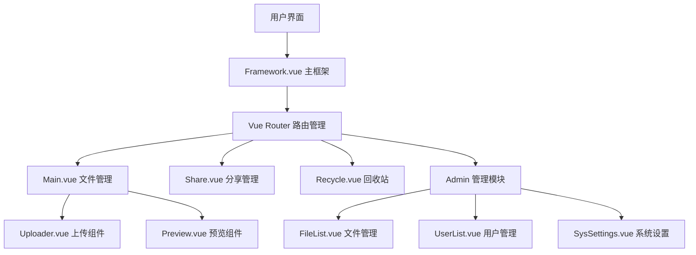

# 优享云盘 简介

## 🎯 概述

### 项目简介

`优享云盘` 是一个现代化的`云存储` Web 平台前端应用，为用户提供直观易用的`文件管理`界面。项目采用 Vue.js 3 + Element Plus 技术栈构建，支持`大文件分片上传`、断点续传、秒传、文件分类管理、在线`预览`、`分享`等核心功能。

### 核心功能

::: tip 七大主要功能

- **文件管理**：支持文件/文件夹的上传、下载、重命名、移动、删除等操作
- **分类浏览**：按文件类型（视频、音频、图片、文档、其他）智能分类展示
- **在线预览**：支持多种文件格式的在线预览功能
- **文件分享**：生成分享链接，支持密码保护和过期时间设置
- **回收站**：已删除文件保留 10 天，支持恢复或永久删除
- **空间管理**：实时显示存储空间使用情况
- **管理后台**：管理员可进行用户管理、文件管理、系统设置

:::

### 用户价值

- **高效管理**：直观的`文件分类`和搜索功能，快速定位所需文件
- **安全可靠**：支持`大文件分片上传`，MD5 校验确保文件完整性
- **便捷分享**：一键生成`分享链接`，支持多种分享方式
- **数据保护**：`回收站`机制防止误删，管理员权限控制确保数据安全

## 🖼️ 项目截图


<br>

<br>

<br>

<br>

## 🎉 架构

### 系统架构概览

优享云盘 前端采用组件化架构设计，基于 Vue.js 3 Composition API 构建：



### 布局架构

:::info 应用采用经典的三栏布局结构：

- **顶部导航栏**：品牌标识、上传入口、用户菜单
- **左侧边栏**：功能导航菜单、文件分类、空间使用情况
- **主内容区**：动态加载的功能页面
  :::

### 路由架构

应用采用嵌套路由设计，主要路由结构如下：

- `/` - 主框架页面
  - `/main/:category` - 文件管理（按分类）
  - `/myshare` - 我的分享
  - `/recycle` - 回收站
  - `/settings/*` - 管理员设置页面
- `/login` - 用户登录
- `/share/:shareId` - 外部分享访问

## ⭐ 核心技术栈

### 核心框架与库

| 技术       | 版本 | 用途     | 特性                                        |
| ---------- | ---- | -------- | ------------------------------------------- |
| Vue.js 3   | ^3.x | 前端框架 | Composition API、响应式数据管理、组件化开发 |
| Vue Router | ^4.x | 路由管理 | 单页应用路由、嵌套路由、路由守卫            |
| Vite       | ^4.x | 构建工具 | 快速开发体验、热重载、ES 模块支持           |

### UI 组件与样式

| 技术         | 版本 | 用途         | 特性                                   |
| ------------ | ---- | ------------ | -------------------------------------- |
| Element Plus | ^2.x | UI 组件库    | 企业级组件、Vue 3 支持、丰富的交互组件 |
| Sass/SCSS    | ^1.x | CSS 预处理器 | 变量、嵌套、混入、模块化样式           |
| Iconfont     | -    | 图标字体     | 统一视觉风格、矢量图标、自定义图标库   |

### 功能库

| 技术         | 版本  | 用途        | 特性                                |
| ------------ | ----- | ----------- | ----------------------------------- |
| SparkMD5     | ^3.x  | 文件校验    | 大文件分片 MD5 计算、文件完整性验证 |
| Highlight.js | ^11.x | 代码高亮    | 多语言语法高亮、代码预览支持        |
| vue-cookies  | ^1.x  | Cookie 管理 | 用户状态持久化、会话管理            |
| Axios        | ^1.x  | HTTP 客户端 | API 请求、拦截器、错误处理          |

## 🛠️ 项目设置

### 环境要求

- **Node.js**: >= 16.0.0
- **npm**: >= 8.0.0 或 **yarn**: >= 1.22.0
- **现代浏览器**: 支持 ES6+ 语法

### 安装步骤

```bash
# 1. 克隆项目
git clone [项目地址]
cd 优享云盘-front

# 2. 安装依赖
npm install
# 或使用 yarn
yarn install

# 3. 启动开发服务器
npm run dev
# 或使用 yarn
yarn dev

# 4. 构建生产版本
npm run build
# 或使用 yarn
yarn build
```

### 可用脚本

- `npm run dev` - 启动开发服务器，支持热重载
- `npm run build` - 构建生产版本
- `npm run preview` - 预览生产构建结果
- `npm run lint` - 代码格式检查和修复

### 项目结构

```
src/
├── assets/          # 静态资源文件
├── components/      # 可复用组件
├── router/          # 路由配置
├── utils/           # 工具函数
├── views/           # 页面组件
│   ├── main/        # 主要功能页面
│   ├── admin/       # 管理员页面
│   ├── share/       # 分享相关页面
│   ├── recycle/     # 回收站页面
│   └── webshare/    # 外部分享页面
├── config/          # 配置文件
└── main.js          # 应用入口文件
```

:::info 核心组件说明

- **Framework.vue**: 应用主框架，包含导航和布局逻辑
- **Main.vue**: 文件管理主页面，支持文件操作和分类浏览
- **Uploader.vue**: 文件上传组件，支持大文件分片上传和进度显示
- **FileList.vue**: 管理员文件列表，提供跨用户文件管理功能
  :::

:::tip 开发注意事项

1. **权限控制**: 管理员功能需要特定权限验证
2. **文件上传**: 大文件采用分片上传机制，需要后端配合处理
3. **错误处理**: 统一的错误处理和用户提示机制

:::
